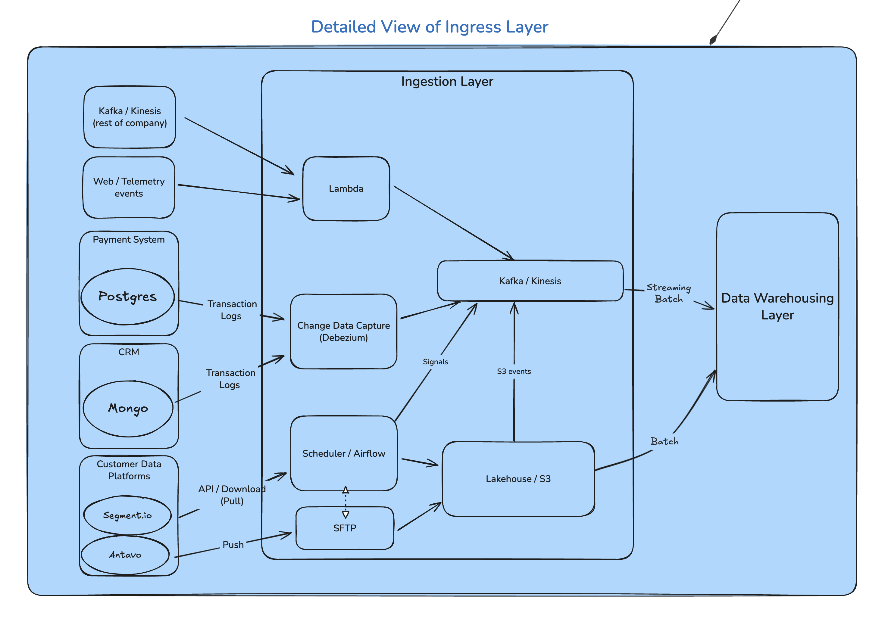

# High Level Design / Architecture

## Problem Statement

Modern applications generate a large amount and variety of data, across many systems. This data, if harnessed, can be a strategic and tactical asset. Please speak to the design of a data pipeline that would facilitate getting value from such data.

## 1. Introduction

This high-level design (HLD) is based on real-world patterns observed in early- and mid-stage SaaS startups. It has been adapted to the scenario of an **AWS-based SaaS platform** supporting a large number of **small businesses**.

> **Note:** Enterprise-scale features such as isolated pipelines, complex data governance, and highly regulated workloads (e.g., healthcare, government) are out of scope.

### Intended audience
Intended audience includes:

- Hiring managers and senior engineers evaluating architecture maturity
- Junior engineers looking to understand a scalable, layered data platform

### Services

The data platform supports the following internal services:

- **CRM** - customer lifecycle, appointments, referrals
- **Invoicing** - service pricing, tax rules, invoice generation
- **Automation** - triggered messages, task automation
- **Product & Service** - flexible catalog management
- **Expense Management** - costs, materials, labor, reporting
- **Access Management** - roles, permissions, delegation
- **Employee Management** - schedules, reimbursements, safety

### Assumptions

- AWS-first infrastructure
- Open-source preference; minimizing vendor lock-in if possible
- Polyglot microservice environment (Postgres, Mongo, 3rd-party APIs)
- Batch + stream ingestion scenarios
- Shared infrastructure (no tenant-level isolation)
- Supports both analytics and production integration
- End customers may receive data access via sharing mechanisms

## Architecture Overview

*Figure 1: High-level view of the data platform*

### Key Design Principles
| Principle                  | Rationale                                              |
|---------------------------|--------------------------------------------------------|
| **Lambda-style ingestion**| Supports both streaming and batch pipelines            |
| **Layered modeling (Bronze -> Gold)** | Clean separation of raw, refined, and modeled data |
| **Lakehouse + Warehouse** | Combines scalable object storage with query engines    |
| **Open and portable stack**| Spark, Delta, Kafka reduce cloud lock-in risk          |

### Lambda Architecture Pattern

The system implements **Lambda architecture**, which combines:
- **Batch Layer**: for high-throughput, eventually consistent processing  
- **Speed Layer**: for low-latency, real-time analytics  
- **Serving Layer**: unified query access over both

#### Why Lambda Architecture Matters:
| Benefit                         | Explanation |
|----------------------------------|-------------|
| **Fault tolerance**             | Batch reprocessing ensures correctness even if real-time jobs fail |
| **Latency + Accuracy tradeoff** | Speed layer provides fast, but possibly approximate, answers; batch layer provides completeness |
| **Operational flexibility**     | Enables onboarding new sources as either streaming or batch based on availability |
| **Unified model**               | Streaming and batch pipelines eventually converge into the same Silver/Gold tables, simplifying BI access |

> In the proposed system, **Apache Kafka or AWS Kinesis with Spark Structured Streaming** power the speed layer, while **SFTP/API jobs + Delta Lake** represent the batch layer.  
> Unified **data contracts**, **schemas**, and **cataloging** (e.g., via Glue) ensure interoperability.

### Core Components

### Ingestion Layer

| Component     | Tools Used                            | Purpose                              |
|--------------|----------------------------------------|--------------------------------------|
| Event ingest  | Kafka / Kinesis, Lambda               | Streaming and push-based collection  |
| File ingest   | Airflow, SFTP, APIs                   | Batch pull / scheduled extractions   |
| CDC capture   | Debezium                              | Transaction log reading (Postgres, Mongo) |
| Storage       | S3 / Delta Lake / Iceberg             | Landing zone for raw and structured data |

### Transformation Layer

| Layer  | Tools / Engines                      | Purpose                                      |
|--------|--------------------------------------|----------------------------------------------|
| DAG Management    | dbt                                 | Data testing, data lineage, simplified modeling |
| Bronze            | S3 + Delta (raw zone)               | Time-partitioned, immutable raw data         |
| Silver            | S3 + Delta (raw zone)               | Cleansing, normalization, enrichment         |
| Gold              | Redshift, Delta (large tables)      | Aggregation, dimensional models, metrics     |

### Processing Engines

- **Spark (on AWS Glue or EMR)**:
  - Glue: serverless, lower maintenance
  - EMR: tunable, faster for large jobs
- **Streaming**: Spark Structured Streaming
  - Reuses Spark pipelines for real-time ingestion
  - Micro-batch limits; Flink may be used for ultra-low-latency needs
- **Redshift**:
  - Store Fact and Dimension tables
  - Columnar storage to support fast analytical queries

### Orchestration

- **Airflow** handles:
  - Task dependencies, retries, scheduling
  - Orchestrating API ingestion, file preparation, dbt runs, and reverse ETL
  - Metadata management and DAG observability

### Messaging & Queuing

| Option   | Pros                               | Cons                                 |
|----------|------------------------------------|--------------------------------------|
| Kafka    | Open-source, low latency, mature   | Higher maintenance                   |
| Kinesis  | AWS-managed, pay-as-you-go         | Not portable across clouds           |

## 4. Ingestion Layer Details

The ingestion layer acts as the upstream of the data platform, handling the flow of data from internal and external systems into the lakehouse. This layer supports both **streaming** and **batch ingestion patterns**.

*Figure 2: Detailed view of the Ingestion Layer*

### Data Sources

| Source Type         | Systems                                | Ingestion Strategy                                |
|---------------------|----------------------------------------|---------------------------------------------------|
| **Operational DBs** | Postgres, MongoDB (CDC via Debezium)   | Log-based change data capture                     |
| **Event Streams**   | Web telemetry, payment events, Segment | Streaming via Kafka / Kinesis                     |
| **Third-Party APIs**| Stripe, Amplitude, Salesforce, etc.    | Scheduled API pulls using Airflow or Lambda       |
| **File Drops**      | CSV, JSON, Parquet                     | Batch load via SFTP, cloud upload, or webhook push|

> Each source is connected through a mechanism that fits its nature:  
> - CDC for transactional databases  
> - Event queues for high-velocity events  
> - Batch landing zones for structured periodic drops  
> - API ingestion for partner platforms or services  

### Routing and Processing Logic

- **Streaming Paths**:
  - Events from upstream systems (e.g., Segment, telemetry) are pushed to Kafka/Kinesis topics
  - Spark Structured Streaming consumes from topics and writes to Delta Lake Bronze tables
  - Late, malformed, or duplicate records are pushed to Dead-Letter Queues (DLQ) with context and sent to alerting systems (e.g., Slack)

- **Batch Paths**:
  - Airflow DAGs orchestrate polling from REST APIs or scheduled SFTP pulls
  - Extracted files are validated (schema, duplication, nulls) and then landed in Bronze as Delta tables

- **Dead-Letter Queues**:
  - Used in both streaming and batch pipelines
  - Enable resilient ingestion by isolating bad records without halting the pipeline
  - Logs metadata (e.g., file name, line number, validation error) for observability and retry handling

## 5. Transformation Layer

This section describes how raw ingested data is progressively transformed into clean, analytics-ready data products using a layered approach.

*Figure 3: Detailed view of the Transformation Layer*

### Medallion Architecture Overview

We follow the **medallion architecture** to progressively enrich and refine data across three layers:

- **Bronze** - raw ingested data (structured or semi-structured), minimally processed  
- **Silver** - cleaned, joined, deduplicated data, normalized into canonical formats  
- **Gold** - aggregated fact tables and dimensional models, ready for business intelligence (BI)

> For detailed transformation logic and medallion-layer modeling definitions, refer to:  
> **Notebook: [LoadData.ipynb](../notebooks/LoadData.ipynb)**

### Path Separation: Batch vs. Streaming

- **Streaming logic** handles late and out-of-order data via watermarks and MERGE operations in Delta Lake.
- **Batch logic** is orchestrated via Airflow and dbt and typically runs on S3-backed data, with deterministic scheduling (e.g., hourly ingestion from APIs or file drops).

| Layer     | Streaming (Real-time)                           | Batch (Scheduled)                            |
|-----------|--------------------------------------------------|-----------------------------------------------|
| Bronze    | Spark Structured Streaming to Delta (append)     | Airflow jobs write CSV/JSON/API data to Delta |
| Silver    | MERGE into Delta with watermark deduplication    | Spark jobs run in Glue or EMR via Airflow     |
| Gold      | Incremental aggregations via Spark or Redshift   | dbt models (hourly/daily) loaded into Redshift|

### Tool Separation: Spark vs. Redshift

| Engine           | Use Case                                 | Role in Medallion Pipeline                       |
|------------------|------------------------------------------|--------------------------------------------------|
| **Glue / EMR**   | Raw ingestion, cleansing, staging        | Bronze -> Silver; joins, filters, SCD prep        |
| **Redshift**     | Fast, interactive querying               | Final Gold layer for dashboards, BI, reporting   |
| **dbt**          | SQL-based transformations, testing       | Silver -> Gold; modeling, semantic layer alignment|

- **Glue** and **EMR** power scalable Spark transformations.
- **Redshift** is used where low-latency, SQL-friendly analytics are required.
- **dbt** ensures reproducible, testable transformations and lineage tracking.

> Spark and dbt models remain portable across engines.

### Storage Separation: S3/Delta vs. Redshift

| Storage Target     | Purpose                                          | Example Outputs                                  |
|--------------------|--------------------------------------------------|--------------------------------------------------|
| **S3 + Delta Lake**| Scalable, low-cost storage for staging and logs | Raw tables, change logs, Silver fact sources     |
| **Redshift Tables**| Optimized for fast OLAP queries                 | `fact_sales_by_customer`, `dim_customer`, KPIs       |

- Intermediate data (Bronze/Silver) is stored in **S3-backed Delta tables**, partitioned by time or logical keys.
- Gold tables are materialized into **Redshift** for serving use cases (BI, dashboards, reverse ETL).
- **Metadata consistency** is ensured using Glue Data Catalog or dbt artifacts.

## 6. Serving & Semantic Layer

The serving layer represents the final stage of the data platform where clean, trusted data is exposed to business users, machine learning models, and operational tools. This layer also enables **reverse ETL**, **data sharing**, and **governed self-service analytics**.

### 6.1 Semantic Models

Semantic modeling adds meaning, structure, and access control on top of raw data models. It bridges the gap between engineered datasets and business understanding.

| Component    | Description |
|--------------|-------------|
| **Cube.dev** | Headless BI layer; provides semantic modeling, caching, and API access to business metrics |
| **dbt exposures** | Declarative metadata about what downstream dashboards and tools depend on a given model |
| **QuickSight / Looker / Mode** | Dashboarding tools for business users; connect to Redshift or Athena |
| **SageMaker Feature Store** | Stores engineered features (from Silver/Gold tables) for ML model training and inference |

> Semantic models define key business entities (e.g., “active customer”, “invoice total”, “net revenue”) using consistent logic, enforced in dbt or Cube.dev.

### 6.2 ML Integration

Analytics-ready datasets from the Gold layer can feed into ML workflows:

- Use **SageMaker Feature Store** to register curated, versioned features
- Train models for predictive analysis, or churn scoring
- Inference results can be written back into Gold tables or served via APIs
- Feature freshness and training/serving skew can be mitigated by deriving features from shared Gold layer logic

### 6.3 Reverse ETL

Reverse ETL pipelines operationalize insights by writing model outputs or metrics back to production systems.

| Use Case                     | Example |
|-----------------------------|---------|
| Sync customer segments       | Push customer details to Salesforce or CRM |
| Alert thresholds             | Trigger Slack alerts from fraud detection scores |
| Application personalization  | Write product recommendation scores into application DB |

> **Airflow DAGs** or **GraphQL endpoints** orchestrate these data movements, ensuring only clean, validated fields are written back.

### 6.4 Governance and Access Control

To ensure safe data usage and compliance:

- **IAM policies** restrict data access at S3, Glue, and Redshift levels
- **Column-level masking** is applied on sensitive PII (e.g., name, email)
- **Data contracts** (via dbt schema enforcement or Avro schemas) ensure stability for consuming teams
- **Audit logs** track access to datasets and dashboards for compliance

## 7. Non-Functional Requirements

A robust data platform must address not only functional correctness but also non-functional aspects such as **scalability**, **security**, **cost-efficiency**, **observability**, and **fault tolerance**. This section outlines the supporting features that ensure long-term operability and resilience.

### 7.1 Scalability & Cost Optimization

The architecture is designed to scale linearly with data volume and processing demand, while keeping infrastructure costs under control.

#### Processing
- **Auto-scaling Glue jobs** allow dynamic resource allocation for Spark workloads based on job size and concurrency.
- **Spot EMR clusters** are used for large-scale backfills and compute-intensive joins, offering up to 90% cost reduction.
- **Concurrency control** via Airflow queues and Glue job bookmarks ensures resource efficiency and avoids contention.

#### Storage
- **S3 Lifecycle Policies**:
  - Raw zone: `90-day` retention policy transitioning to Glacier, to minimize long-term cost
- **Partitioning and compaction** reduce small-file overhead and improve query performance

#### Cost Monitoring
- AWS Cost Explorer and CloudWatch metrics are used to track resource usage

### 7.2 Security

Security is integrated into the design from ingestion to serving.

#### Data Access
- **IAM least privilege** Role-based Access (RBAC) for all roles, services, and DAGs
- **Per-environment isolation** using dedicated S3 buckets and role-based policies in different regions
- **Fine-grained access control** in Redshift via schemas and row/column-level permissions

#### Data Protection
- **Column-level encryption** for PII at rest (e.g., `email`, `payment_info`) using KMS keys
- **Tokenization or masking** strategies for sensitive fields in test environments

#### Network
- **VPC Endpoints** for secure access to S3 and Redshift without public internet exposure
- **Security Groups** tightly scoped to known ports and IP ranges

### 7.3 Monitoring, Observability, and Alerting

A multi-layered monitoring setup ensures visibility into system health, data quality, and SLAs.

#### Pipeline Monitoring
- **Airflow DAG monitoring**: SLA miss tracking, retries, email or Slack alerts
- **Glue / EMR metrics**: job runtime, failure rate, throughput (via CloudWatch)

#### Data Quality Monitoring
- **Great Expectations** or **dbt tests** are executed in Silver to Gold transformation steps:
  - Null checks, uniqueness, value ranges, referential integrity
  - Test results are published to Airflow or Slack

#### Log Aggregation
- Unified logs from Glue, Airflow, and Spark are routed to:
  - **CloudWatch Logs**
  - **Datadog**, **Grafana**, or **Elasticsearch** for dashboarding and correlation

#### Lineage & Auditability
- Metadata lineage is tracked via **dbt artifacts**, **Airflow run metadata**, and **Glue Catalog**

### 7.4 Risk Mitigation and Fault Tolerance

The platform is built to recover from data corruption, job failure, and infrastructure outages.

#### Data Versioning and Rollbacks
- **Delta Lake time travel** allows rollback to previous versions in case of logic bugs or bad loads
- **CDC replay support** through Debezium offsets and Kafka topic retention

#### High Availability
- **Redshift RA3 clusters** support Multi-AZ deployments with fault-tolerant node replication
- **Cross-region S3 replication** ensures DR-ready data redundancy
- **Glue checkpointing** and **Spark watermarking** support replay-safe streaming recovery

#### Alerting and Escalation
- Failures in any layer (ingestion, transformation, serving) trigger Slack alerts and PagerDuty incidents
- DLQ volumes are monitored to detect upstream schema drifts or data spikes

## 8. Conclusion

The proposed AWS‑centric, open-source‑friendly data platform is designed to balance cost, latency, scalability, and agility. It evolves naturally from MVP to enterprise-scale and enables processing billions of records across batch and streaming use cases.

**-> [final diagram](https://excalidraw.com/#json=2qW_0FmwiGBiluRPY_dbA,lGt3KTxBM1FTNFqnzCx8UQ)**
* Platform High‑Level (green) - orchestration, serving, sharing
* Ingress Detail (blue) - sources -> Kafka/Kinesis -> Raw S3
* Transformation View (yellow) - Spark + dbt implementing Bronze->Silver->Gold

*Figure 4: All Diagrams Together*

That said, architecture is never one-size-fits-all. Implementation details (such as storage formats, orchestration frequency, or table schemas) must be tailored to the actual needs of the product, stakeholders, and data sources.

> While this architecture is robust and extensible, simplicity must remain a guiding principle.
> **KISS: Keep It Stupidly Simple**: complexity should only be added when justified by scale, maintainability, or business need.

Ultimately, the goal is to deliver trustworthy, scalable data products with minimal operational overhead.